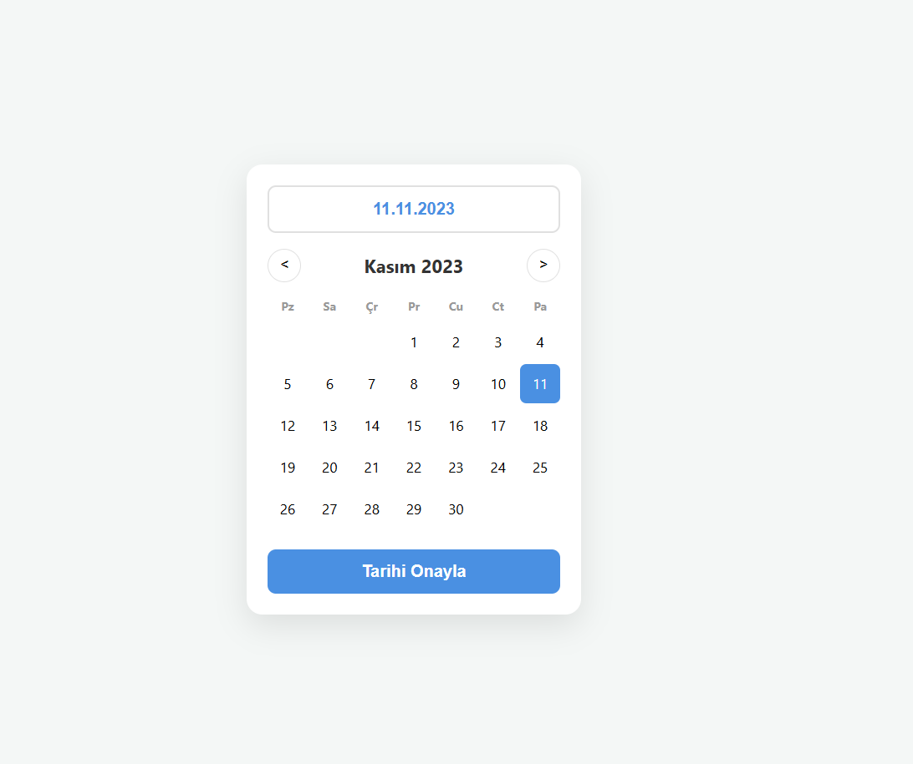

# 📅 Modern DatePicker (JS, HTML, CSS)

## Proje Görünümü

Bu proje, harici kütüphane (jQuery vb.) kullanmadan, saf JavaScript (**Vanilla JS**), HTML5 ve CSS3 kullanılarak geliştirilmiş, modern ve kullanıcı dostu bir tarih seçici (datepicker) arayüzüdür.

* **Dinamik Takvim:** Ay ve yıl değişimlerine göre günleri ve haftanın başlangıç günlerini otomatik hesaplar.
* **Responsive Tasarım:** CSS Grid ve Flexbox kullanılarak her ekrana uyumlu hale getirilmiştir.
* **Seçim Geri Bildirimi:** Seçilen tarih görsel olarak vurgulanır ve üstteki input alanına anlık yansıtılır.
* **Özel Format:** Tarihler `tr-TR` yerel formatına uygun şekilde (Örn: 26 Şubat 2026) gösterilir.
* **Hata Kontrolü:** Tarih seçilmeden onay butonuna basıldığında kullanıcıyı uyarır.

## 🚀 Kurulum ve Kullanım

## 🛠 Kullanılan Teknolojiler

* **HTML5:** Semantik yapı.
* **CSS3:** Modern grid sistemleri ve özel değişkenler (CSS Variables).
* **JavaScript:** Saf Vanilla JS (ES6+).

## 📸 Ekran Görüntüsü Mantığı
Takvim yapısı, JS tarafındaki `Date()` objesiyle şu mantıkla çalışır:
- Ayın ilk gününün index'i bulunur.
- Ayın toplam gün sayısı hesaplanır.
- Döngü ile ızgara (grid) içine DOM elemanları yerleştirilir.
  
---
Geliştiren: [Mehmet Aydın]
